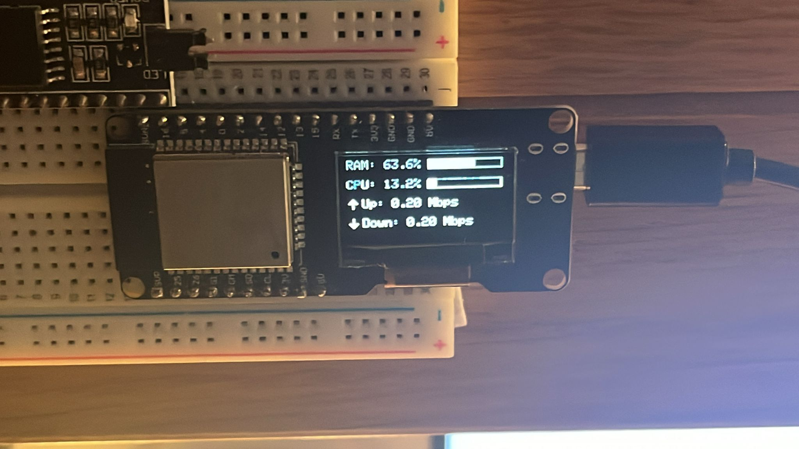

# ESP32 OLED System Monitor with Screen Saver

## Overview

This project uses an ESP32 to display system monitoring information on an OLED screen. The screen shows CPU usage, RAM usage, and network speeds (upload/download) with custom arrow icons for the data flow direction. Additionally, the system implements a screen saver feature to turn off the OLED display after 20 seconds of inactivity (client disconnection).

The project involves the following features:
1. **Dynamic display** of CPU, RAM, and network speed with real-time updates.
2. **Custom icons** for upload/download data with flickering arrows when the speed exceeds 5 Mbps.
3. **Screen Saver ISR** to turn off the OLED after 20 seconds of client inactivity.
4. **Automatic system restart** if the client is disconnected for more than the allowed time.

## Hardware Requirements

- ESP32 module
- SSD1306 OLED display (128x64 pixels)
- USB cable for programming
- Jumper wires and breadboard (for connections)

## Software Requirements

- Arduino IDE (with ESP32 board support)
- Required Libraries:
  - `Adafruit GFX Library`
  - `Adafruit SSD1306 Library`
  - `ArduinoJson Library`
  - `esp_timer` (comes with ESP32 core)

## Installation

1. Clone this repository or download the project files.
2. Open the project in the Arduino IDE.
3. Install the required libraries through the Arduino Library Manager.
4. Set up the correct board and port in Arduino IDE:
   - **Board**: ESP32
   - **Port**: Select your ESP32's port
5. Update the Wi-Fi credentials in the code:
   ```cpp
   #define STASSID "Your_SSID"
   #define STAPSK  "Your_Password"
6. Upload the code to the ESP32.


## Usage
    Once the code is uploaded, the ESP32 will connect to the specified Wi-Fi network and start displaying system monitoring data on the OLED.

    Features:
    Dynamic Arrow Icons: The upload and download arrows will flicker when speeds exceed 5 Mbps.
    Screen Saver: The OLED will automatically turn off if no client is connected for 20 seconds.
    Automatic Restart: If the client is disconnected, the OLED will display "Client Disconnected" for 10 seconds before the ESP32 restarts.
    Wiring Diagram
    ESP32 Pin	OLED Pin
    GPIO 5	SDA
    GPIO 4	SCL
    3.3V	VCC
    GND	GND

## Example Output
    RAM: 62.3%
    CPU: 6.6%
    Up: 3472.0 Kbps
    Down: 82560.0 Kbps



## License
    This project is licensed under the MIT License.

    Troubleshooting
    OLED not displaying anything: Ensure the wiring is correct and the OLED address matches (usually 0x3C for SSD1306).
