# Contents

1.Introduction
2.Leap Motion
  - Construction of development environment	
  - Understanding Leap Motion Architecture and setup	
  - Leap motion setup Files:	
  - API construction:
3. Arduino-based analog and digital circuit experiments	
    - digital circuit experiment	
    - Nand and Nor logic gate circuit	
4. Analogue experiment
    - Leap Motion controlled diode I-V characteristic experiment.	
5. Conclusion

# Introduction

With the advancement of microelectronics, the ways of human-computer
interaction have also become richer.

This experimental project is divided into two parts:

1.  human-computer interface provided by Leap Motion，

  - API development and Leap application exploration

2.  Arduino-based analog and digital circuit experiment:

  - digital circuit experiment

  - NAND and NOR logic gate circuit

  - Analog circuit experiment:

  - Leap Motion controlled diode I-V characteristic experiment.

# Leap Motion

Experiments based on Leap Motion will explore how finger-based hardware
interacts.

There are two most challenging parts in the development of Leap Motion.

### Construction of development environment

Python compatibility issues

The Leap library is not in the pip installation environment, and the
Leap library needs to be installed manually.

Due to the lack of Leap Python environment documentation in the
construction of the runtime environment, I encountered many difficulties
in installing the runtime environment. I first tried to install Leap
using pip. After trying, I found that Leap in the pip environment is a
third-party library with the same name as the Leap Motion library.

I tried and tested many different methods to get blank to work.
Unfortunately, every different approach, I tried never gave me the
result I wanted. I was very thankful to my professor when they gave me
help with the package I received. I tried again and thankfully I found
the method to work in my favor and got the results I needed.

Installation The installation process is as follows:

#### 1. download

The Leap Motion development environment is developed based on python2,
since python stopped supporting python2 in January 2020.

Leap service driver problem

The Driver used in this project is,
Leap_Motion_Installer_release_public_win_x86_2.3.1+31549_ah1886

Different driver might have compatibility issue with different leap
motions models.

If during the installation you find the Leap motion software fails to
detect the controller, it is very likely that the driver is not fit for
the model you’re using. Instead, you might what to try historical
release of the driver to resolve the issues.

Legacy Releases: <https://developer.leapmotion.com/releases>

### 2. Understanding Leap Motion Architecture and setup

Leap motion provides two types of Architecture: Native Application
Interface and WebSocket Interface.

We choose to use the Native Application Interface as our develop
environment as the Arduino experiment is mainly based on Local machine
serial port communication.

Leap Mothing Service functions
as data collection form the Leap Motion controller, it tracks data via
the serial port to the controller and process it so it’s accessible to
the foreground applications.

Documentation on the Architecture:
<https://developer-archive.leapmotion.com/documentation/cpp/devguide/Leap_Architecture.html>

Leap Motion provides it own application form the IDK for testing and
tracking preppers. It could be accessed in the Control Panel applet.

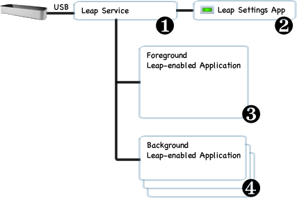The Leap motion is properly
connected when the icon is green. Otherwise, it will appear black when
it not connected/ a undetected issue with the connection, or yellow when
there’s an error such as the controller detects smudge on the camara of
the controller or bandwidth of the USB connection is not sufficient.

Leap Motion Diagnostics:
<https://support.leapmotion.com/hc/en-us/articles/360004363657-Running-the-Leap-Motion-Diagnostics>

Once the Leap Motion Controller is correctly settled, you’ll be able to
access the IDK embedded application for testing and debugging, !! insert
picture

Leap motion Diagnostic Visualizer provides a 3D graphic interface for
you to intuitively the tracking results of the Leap Motion controller.

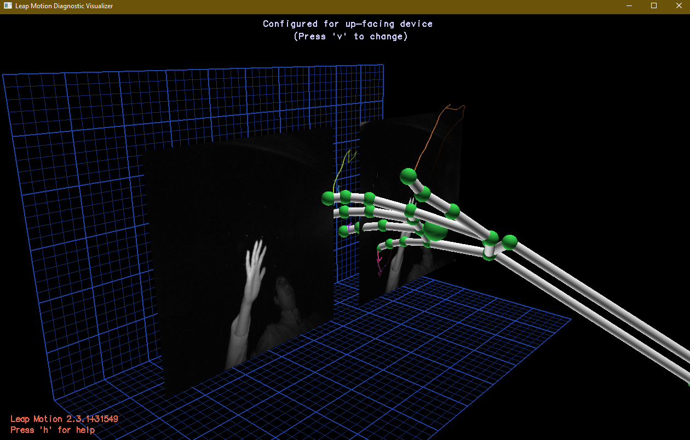

In this project, we use Python programming language as our development
scrip language.

As the Leap Motion environment does not support Python3, we must install
python 2 to execute our program.

You need to:

1.  Install python 2.7.0 environment:

Python 2.7.0 Release: <https://www.python.org/download/releases/2.7/>

2.  Install Leap motion IDK:

<https://developer.leapmotion.com/tracking-software-download>

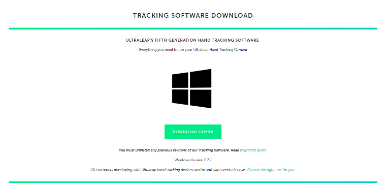

3.  Install Python Leap package for Leap motion.

Download python package:
<https://github.com/Qinyuan72/Python27_Leap_test/blob/master/Python27_Leap.rar>

Unzip the file follow the guide:

1\. Copy LeapSDK\lib\Leap.py to C:\Python27\Lib\Leap.py

2\. Copy 3 files in LeapSDK\include (Leap.h, Leap.i, LeapMath.i) to
C:\Python27\include directory

3\. Copy 9 files from LeapSDK\lib\x64 to C:\Python27\DLLs directory

> 4\. Testing
>
> Try run sample in terminal:
>
> C:\Python27\python.exe ' (your SKD directory).
> \Python27_Leap\Sample.py'

For scrip access of the Leap
motion: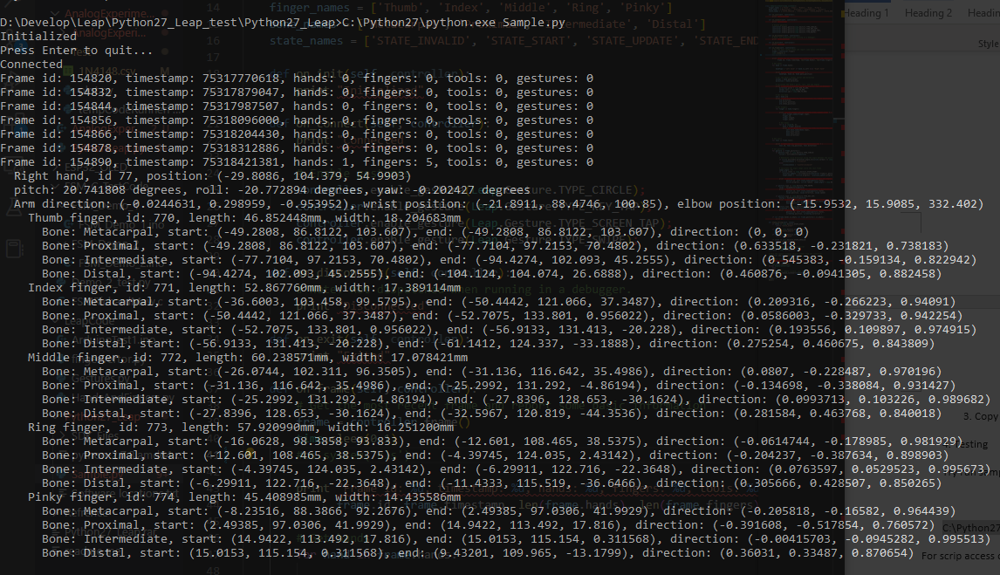

Once it’s correctly settled you will be able to see the tracking
information form in the terminal.

### Leap motion setup Files:

Sample.py included in the SDK contains all the structure you need to
develop the application in this document

Leap motion tracks data on a per frame basis, to access the current
frame you need to add this call to frame() to your \|Listener_onFrame\|
callback:

def on_frame(self, controller):
    # Get the most recent frame and report some basic information
    frame = controller.frame()

Then, print out some properties of
the [**Frame**](https://developer-archive.leapmotion.com/documentation/python/api/Leap.Frame.html) object:

            print "Frame id: %d, timestamp: %d, hands: %d, fingers: %d,
    tools: %d, gestures: %d" % (frame.id, frame.timestamp, len(frame.hands),
    len(frame.fingers), len(frame.tools), len(frame.gestures()))

Similarly, to access hands, fingers etc... You need to call the
corresponding class following the syntax:

            for hand in frame.hands:
                handType = "Left hand" if hand.is_left else "Right hand"
                print "  %s, id %d, position: %s" % (
    
                    handType, hand.id, hand.palm_position)
    
                for finger in hand.fingers:
    
                    print "    %s finger, id: %d, length: %fmm, width: %fmm"
    % (
    
                        self.finger_names\[finger.type\],
    
                        finger.id,
    
                        finger.length,
    
                        finger.width)

To access gestures, use the syntax as follows:

        for gesture in frame.gestures():

            if gesture.type == Leap.Gesture.TYPE_CIRCLE:

                circle = CircleGesture(gesture)

The main function contains the setup for the listener and controller
object to support the function of Leap Motion, in future project, we
would need to add setup code for other functions like serial port
connection here:

def main():

    \# Create a sample listener and controller

    global f

    f = open('AnalogExperiment1//Test//1N4148.csv','a+')

    global UNO_Serial1

    UNO_Serial1 = UNO_Serial()

    listener = SampleListener()

    controller = Leap.Controller()

    \# Have the sample listener receive events from the controller

    controller.add_listener(listener)

    \# Keep this process running until Enter is pressed

    print "Press Enter to quit..."

    try:

        sys.stdin.readline()

    except KeyboardInterrupt:

        pass

    finally:

        \# Remove the sample listener when done

        controller.remove_listener(listener)

### API construction:

Arduino is used as the develop language for both the digital analog
experiment. We used Arduino Uno, Arduino every and NodeMCU. In the
projects developed, we mainly focused on the using Serial based API and
experimented with sockets-based communication.

#### Serial-based API:

Serial port communication is commonly used between Arduino board and
computer. All Arduino boards have at least one serial port. To enable
communication between the Leap motion controller, we need to configure
both sides’ scripts to establish the communication.

On the PC side, Pyserial needs to be manually installed on your python
2.7, as pip no longer supports Python 2.7 since Jan 2022

Download pyserial-3.4.tar.gz form pyserial.PyPI

Pyserial 3.4 Download:
[https://pypi.org/project/pyserial/3.4/#files](https://pypi.org/project/pyserial/3.4/%23files)

Unzip the folder pyserial-3.4 to c:\Python27\Lib\site-packages

Open a command window (Start -\> All Programs -\> Accessories -\>
Command Prompt) and type into the command line: cd
c:\Python27\Lib\site-packages\pyserial-2.6

Install pySerial by typing this command (including the path):
c:\Python27\python.exe setup.py install

In this project, we created a finite State Machine (FSM) to test and
implement the API. To make to code more modular and readable, a separate
class for Serial communication is used. This configuration allows easier
implementation in the Leap Motion scripts.

The def \_\_init\_\_(self): helps configure the open and configure
Serial port

    class UNO_Serial:
        def \_\_init\_\_(self):
            self.arduino = serial.Serial(port='COM3', baudrate=115200,timeout=.1)
	        self.arduino.readline()

The write function converts the input string to an ASCII encoded binary
stream and send it via the serial port:

    def write(self, x):
        self.arduino.write(bytes(x, 'ASCII'))
        time.sleep(0.01)

inputFormart covers the Input to ‘’\$ + number” format, \$ is used as an
identified for the FSM to recognize a new coming command.

To start the serial port:

    def main():
        global UNO_Serial1
        UNO_Serial1 = UNO_Serial()

In the Arduino code:

    Serial.begin(115200);

The setup line for Arduino to open its serial port and set the baud rate
to 115200.

    int serialRead()
    {
      while (Serial.available() \> 0)
      {
        char c = Serial.read();
        if (c == '\$')
        {
          Serial.println("'\$'Received");
          char c = Serial.read();
          c = c - 48;
          return c;
          Serial.println(c);
        }
      }
    }

SerialRead constantly scans the serial buffer and once there’s data
starting with “\$”, it’ll strip the “\$” and return the rest of the data
as an integer.

Code of the FSM:
<https://github.com/Qinyuan72/Python27_Leap_test/tree/master/FSM_C_TestCode>

#### Based on sockets.

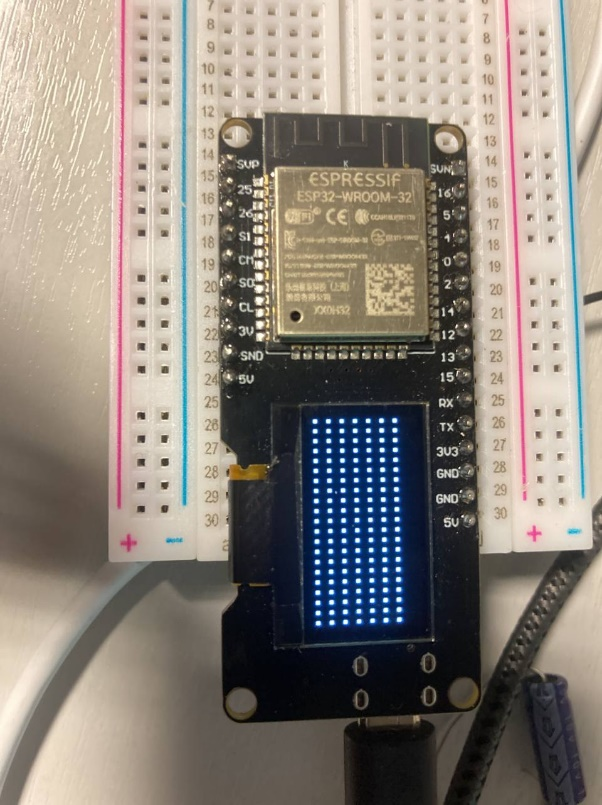In the Gestures project, we
tested a network-based connection based on sockets protocol. Socket
protocol is based on TCP/IP protocol, it provides a level of abstraction
toward the TCP protocol, so that the user only needs to configure the IP
address and network port to achieve data transmission.

As this experiment requires a Wi-Fi module, an esp32 unite with an
onboard OLED is used. The esp32 MCU supports Wi-fi connectivity, and the
OLED is used to display information and debug.

In this project we tested 2 projects based on socket protocol:

Gestures.py:
<https://github.com/Qinyuan72/Python27_Leap_test/blob/master/LeapCode/Gestures.py>

Gestuers.py uses the Gestures tools provide by leap motion to detect
user’s hand gesture. The code detects user gesture and send a message of
the gesture to an MCU (microcontroller unit) with wi-fi connectivity and
OLED display.

HandsAndFingers.py:
<https://github.com/Qinyuan72/Python27_Leap_test/blob/master/LeapCode/HandsAndFingers.py>

HandsAndFingers.py is a project introduced to familiarize myself with
Leap motion environment, it detects the left/right hands and give the
total number of fingers detects by the Leap motion controller. And use
the same code to deliver a message to the MCU as Gestures.py.

    class espSocket:
    
        sock=0
    
        stCompar = ''
    
        def \_\_init\_\_(self,espSocketConfig):
    
            self.espSocketConfig = espSocketConfig
    
       
    
        def espSocket_start(self):
    
            self.sock = socket.socket()
    
            print('Networkconfig: '+str(self.espSocketConfig)+'
    Connecting...')
            try:
                self.sock.connect((self.espSocketConfig))
                print("Socket connection successful")
            except:
                print("Socket connection failed")
       
    
        def socket_send(self,st):
            if st != self.stCompar:
                self.sock.sendall(bytes("\$%s" % st))
                print("sent:%s"%st)
                self.stCompar = st
    
    def main():
        global espSocket8266
        espSocket8266 = espSocket(espSocketConfig=('192.168.31.154',8080))#
        espSocket8266.espSocket_start()

The structure of the socketAPI is similar with the serial API. An new
class made to handle the configuration of the socket connection and data
format process. The initialization method handles the configuration,
espSocket_start hands the establishment of the connection. socket_send
configures and send the data.

To send data, only one line is required in on_frame:

espSocket8266.socket_send(espSocket8266.LCD_str_inputmaker(framInfo))

line 64, HandsAndFingers.py:

OLEDTextDisplay.ino:
<https://github.com/Qinyuan72/Python27_Leap_test/blob/master/ESP32_OLED/OLEDTextDisplay/OLEDTextDisplay.ino>

OLEDTextDisplay.ino contains the Arduino side of the code. The setup
function contains the setup for both the OLED display and the Wi-Fi
module, the loop function monitors the buffer of the Wi-Fi incoming
data, and display the data on the OLED when there’s no new data
available.

# Arduino-based analog and digital circuit experiments

## digital circuit experiment

### Nand and Nor logic gate circuit

The digital circuit experiment is based on FSM project.

The python code for Leap motion is used to detect the angle of curling
of the fingers. And send data to FSM to control the output of 4 pins.
The FSM part configures the pin output and display the digital reading
form Logical circuits.

In this experiment, we use the index finger and middle finger of the
left and right hands to control the 4 pins respectively. For example,
when the middle finger of the right-hand points down, pin 1 will output
a high level, and when lifted, it will return to a low level.

In the circuit we use 4 pins linked to a logic gate as input. And use 3
digital input pins of Arduino as the input value and display it on a
1602 LDC display in the form of binary system.

A sample of the hand detection is attached:

        if len(frame.hands) == 2:

            hand = frame.hands.rightmost

To ensure the only process data when 2 hands are detected and aways
start form the hand at right most side

            print"Right most hand"

            for finger in hand.fingers:

                if self.finger_names\[finger.type\] == "Index":

                    print "    %s finger, id: %d, length: %fmm, width:
%fmm" % (self.finger_names\[finger.type\], finger.id, finger.length,
finger.width)

The line above illiterate though all the fingers and identify the index
and middle fingers.

                    bone = finger.bone(3)

                    print "      Bone: %s, direction: %s" %
(self.bone_names\[bone.type\], degrees(acos(bone.direction\[2\])))

                    if degrees(acos(bone.direction\[2\])) \> 45:

                        arr\[1\] = True

            hand = frame.hands.rightmost

The line marked yellow access the Distal phalanges of the finger, The
line marked read calculate the angle between the direction vector and
the horizontal plane.

If the angle is larger than 45 degrees, the 4-bit array created for
toggling the bit will be stored as Boole value true, the 4bit array will
be converted to an integer and send to the Arduino in the end of the
program

        b = arr

        val = reduce(lambda byte, bit: byte\*2 + bit, b, 0)

        print val

        if val != self.valTest:

            UNO_Serial1.write(UNO_Serial1.inputFormart(17))

            UNO_Serial1.write(UNO_Serial1.inputFormart(val))

            self.valTest = val

           

At the end of the code, we convers the 4 bit ‘arr’ array to a integer
value ‘val’ and send to though the API developed earlier.

In the Arduino side, an FSM is implemented. The FSM uses a switch case
statement, it contains a base case 0, and 15 cases of 4 pin output form
1 – 15

In Arduino the common way to implement FSM is to use the case switch
statement.

In this project, we use the enumerator to declare all the states (line
24 – 43 FSM_Demo_2) and use a case switch statement to navigate though
all the stats in the FSM(line 74 - 403).

FSM_Demo_2.ino:
<https://github.com/Qinyuan72/Python27_Leap_test/blob/master/FSM_C_TestCode/FSM_Demo_2/FSM_Demo_2.ino>

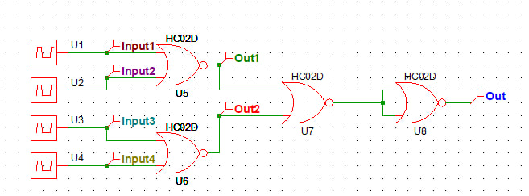The logic gate circuit wiring
is demonstrated in the diagram
below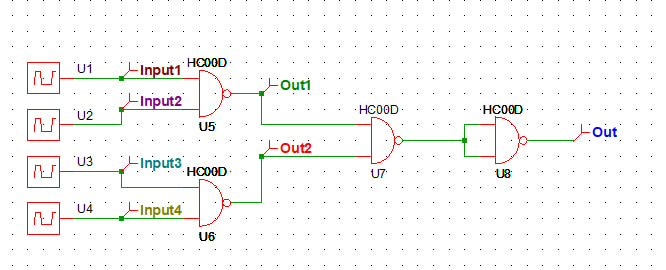

SN74HC00N (NAND) and SN74HC02N (NOR) is selected in this project.

Before the construction of the circuit a simulation is run to ensure the
expected result:

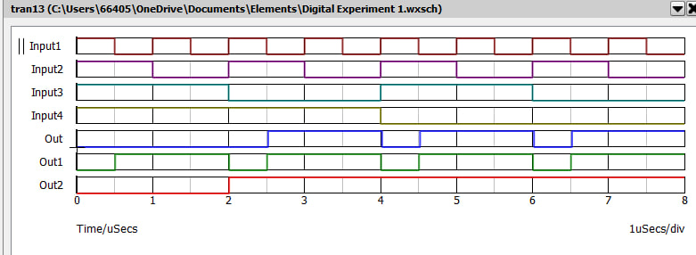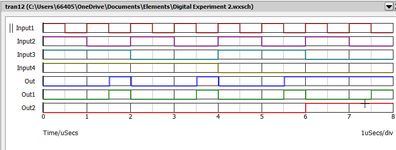

The circuit is constracted as the picture, an LCD montor is added for
both show the FSM state and display the reading form the digital read
port.

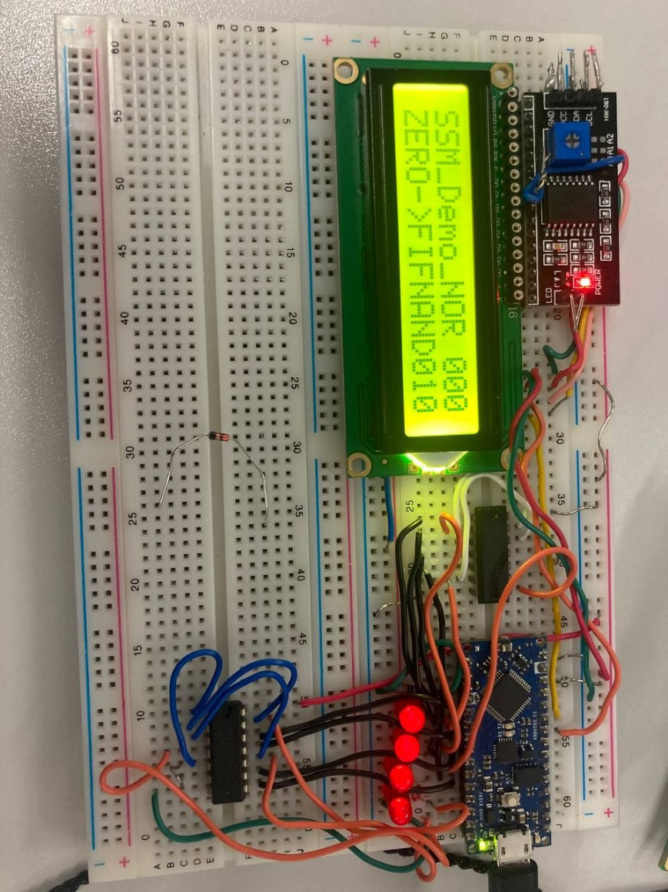

## Analogue experiment

### Leap Motion controlled diode I-V characteristic experiment.

The purpose of the experiment is to test the I-V characteristics of the
Schottky diode (BAT85) and silicon diode (1N4148).

In the Analogue experiment, we use the palm position of the hand
detected from Leap motion controller to controller the PWM output, and a
circuit to convert the PWM to a DC output. The DC output is then used as
testing voltage input for the testing.

In the Leap motion part of the code, a plot function is also
incorporated, and triggered by the swipe gesture in the code.

As the NumPy and Matplotlib no longer supports Python2, we used the os
standard library to call a separated scrip that will run in python3 in a
separate environment (highlighted in blue).

        for gesture in frame.gestures():

            if gesture.type == Leap.Gesture.TYPE_SWIPE:

                swipe = SwipeGesture(gesture)

                print "  Swipe id: %d, state: %s, position: %s,
direction: %s, speed: %f" % (gesture.id,
self.state_names\[gesture.state\],swipe.position, swipe.direction,
swipe.speed)

                self.frameInfo = "swipe"

                self.plotData()

                time.sleep(1)

    def plotData(self):

        f.close

        os.system('python AnalogExperiment1\Test\plot.py')

        pass

line 68 -81:
<https://github.com/Qinyuan72/Python27_Leap_test/blob/master/AnalogExperiment1/PythonLeap.py>

The plot code imports a CSV file saved by the leap motion code and
calculate the voltage and current to plot an I-v

    Characteristic diagram.
    
    import matplotlib.pyplot as plt
    
    import numpy as np
    
    zenerData = np.loadtxt('AnalogExperiment1//Test//1N4148.csv',
    delimiter=',')
    
    zenerData\[:,1\] = zenerData\[:,1\] \* 0.0048828125
    
    zenerData\[:,2\] = zenerData\[:,2\] \* 0.0048828125
    
    i = zenerData\[:,1\]/1000
    
    v = zenerData\[:,2\] - zenerData\[:,1\]
    
    fig, ax = plt.subplots()
    
    ax.scatter(v,i\*1000, marker='.', s = 1)
    
    plt.title('1N4148 Zener diode I-V characteristics')
    
    plt.xlabel('Votage(V)')
    
    plt.ylabel('Current(mA)')
    
    plt.show()

Plot code:
<https://github.com/Qinyuan72/Python27_Leap_test/blob/master/AnalogExperiment1/Test/plot.py>

        for hand in frame.hands:

            handType = "Left hand" if hand.is_left else "Right hand"

            print "  %s, id %d, position: %s" % (

                handType, hand.id, hand.palm_position)

       

            val = hand.palm_position\[1\]

            val = int((val-100)/2)

            if (val \>= 0 and val \<=255):

                if val != self.valTest:

                    UNO_Serial1.write(UNO_Serial1.inputFormart(val))

                    self.valTest = val

            else:

                print "Out of range val = %s" % val

            print ('PWM value: %s' % val)

            dataArry = UNO_Serial1.format(UNO_Serial1.arduino.read(100))

            print(dataArry)

            UNO_Serial1.writeData(dataArry)

The highlighted part (Blue) of the code extracts the palm position form
the hand object and convert the value to change the range of the
triggering position. When the vale of the converted palm position is
within 0 – 255, the value is sent through the serial port to the Arduino
board to set the PWM value.

The Arduino part uses pin 6 as the PWM output and analog A1 and A0 as
the measuring pin for the voltage drop across the diode, A1 and A0 is
pin is connected to the 10 bits ADC module, the ADC converts the analog
voltage signal to a digital integer ranging from 0-1024 in 0-5 Volte. By
multiplying a factor approximately 0.0049 we will have a voltage reading
form the ADC port.

The circuit use LM324 op-amp as an insulation instrument, the PWM is
separated from the DC conversion circuit, and the output is also
insulated by another LM324 op-amp, the PWM to DC conversion circuit uses
a simple RC circuit to flatten the PWM signal.

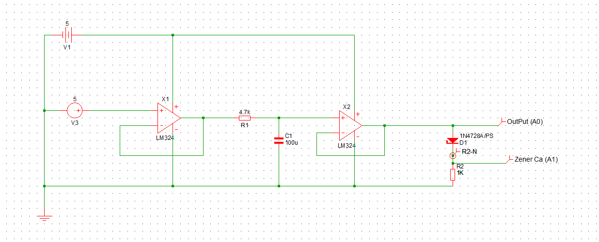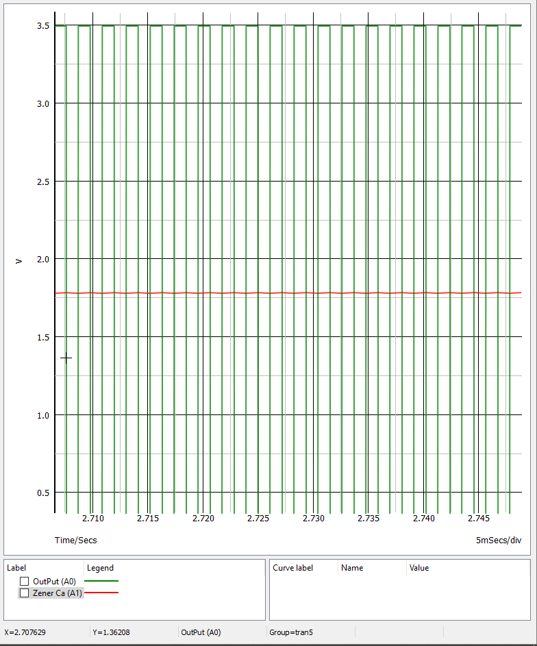

The finished circuit construction is shown:

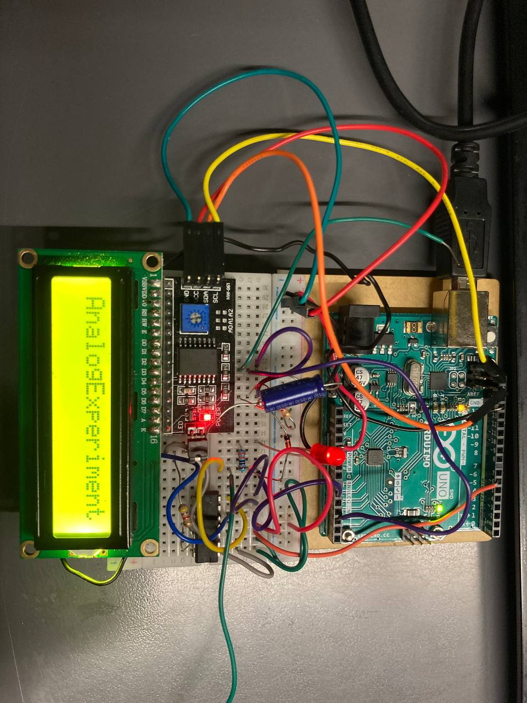

The ADC the result matches the expected output characteristics, but with
inaccuracy.

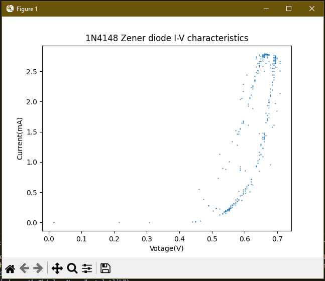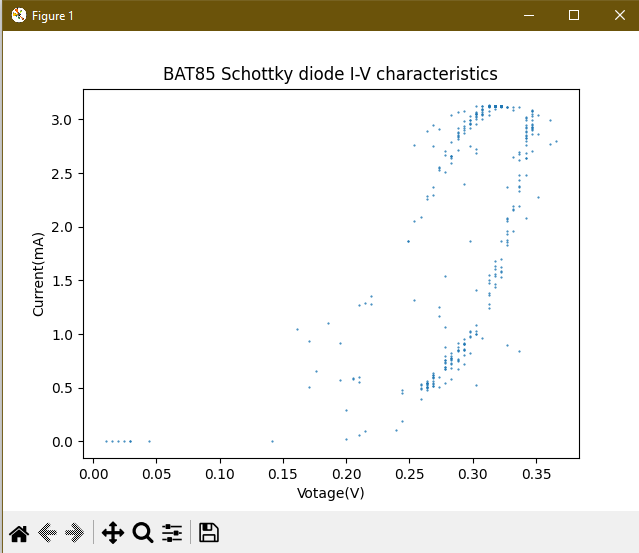

Although we can clearly see the correct line I-V form the scatter plot
for both diode, there’s a line above the expected line that might be
caused by some error. This inaccuracy might be caused by the variation
in the refence power supply voltage.

As a compensation and reference for the experiment, a complementary
simulation is done to show the expected results:

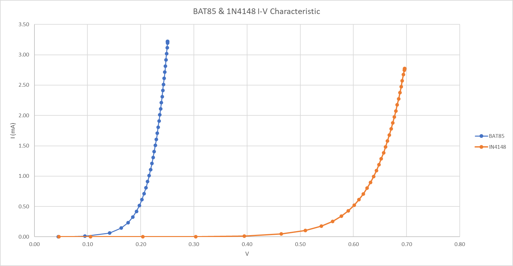

# Conclusion

The project delved into the realm of non-contact Human-Computer Interaction, leveraging the capabilities of the Leap Motion controller. This innovative platform facilitated the tracking of hand movements, while Arduino and Python code formed the backbone of our experimental setup. Throughout the project, we developed several prototypes aimed at controlling laboratory equipment through non-contact methods.

Our prototypes not only showcased the potential but also the feasibility of utilizing the Leap Motion controller in a Human-Computer Interaction laboratory system. This research opens up exciting possibilities for a hands-free and intuitive approach to interfacing with computer systems, promising a future where technology seamlessly integrates with human gestures.

